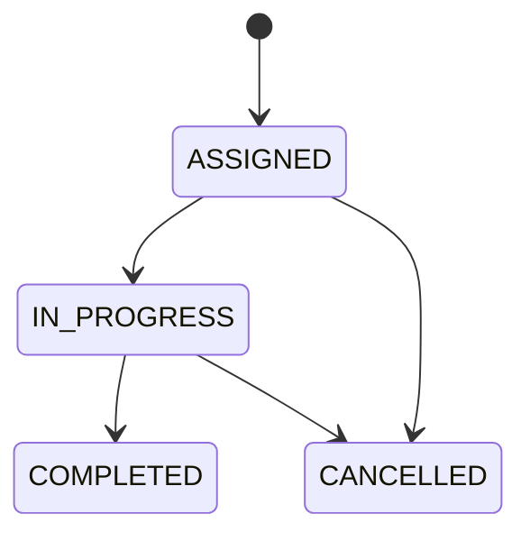

# Task API Go Ionix

API REST en Go para gestión de usuarios y tareas con control por roles (ADMIN, EXECUTOR, AUDITOR), autenticación JWT, migraciones SQL versionadas y arquitectura por capas.

## Desafio

Este proyecto implementa una API evaluable para un challenge técnico, priorizando:

- reglas de negocio claras por rol;
- trazabilidad de cambios por sprints;
- verificabilidad con tests, Docker y colección Postman;
- documentación técnica para revision rapida.

## Stack técnico

- Go 1.25+
- Gin
- PostgreSQL 16
- pgx/pgxpool
- JWT (HMAC)
- bcrypt
- golang-migrate
- Docker y Docker Compose

## Arquitectura por capas

Capas principales:

- `handler`: transporte HTTP, bind/validate, mapping de errores.
- `service`: reglas de negocio.
- `repository`: acceso a datos SQL.
- `database`: conexion, migraciones y seed.
- `domain`: entidades de negocio.
- `dto`: contratos de entrada/salida.
- `middleware`: autenticación/autorización.
- `security`: JWT y hashing.
- `response`: formato estandar de respuesta.

Flujo:

`request -> gin router -> middleware -> handler -> service -> repository -> PostgreSQL`

Diagrama Mermaid: [docs/diagrams/architecture.mmd](docs/diagrams/architecture.mmd)

## Estructura de carpetas

```text
cmd/
  api/
  migrate/
internal/
  common/enums/
  config/
  database/
  domain/
  dto/
  errors/
  handler/
  middleware/
  repository/
  response/
  routes/
  security/
  service/
migrations/
docs/
  API.md
  ARCHITECTURE.md
  diagrams/
postman/
  Task API.postman_collection.json
```

## Ejecutar con Docker

1. Copiar variables de ejemplo:

```bash
cp .env.example .env
```

2. Levantar stack:

```bash
docker compose up --build
```

3. Detener stack:

```bash
docker compose down
```

## Variables de entorno

Referencias en [.env.example](.env.example):

- `APP_PORT`
- `DB_HOST`, `DB_PORT`, `DB_USER`, `DB_PASSWORD`, `DB_NAME`, `DB_SSLMODE`
- `JWT_SECRET`, `JWT_EXPIRATION_HOURS`
- `MIGRATIONS_PATH`
- `ADMIN_EMAIL`, `ADMIN_PASSWORD`, `ADMIN_NAME`

## Migraciones SQL

- Carpeta: [migrations](migrations)
- Estrategia: versionadas, sin automigrate.
- Ejecución automatica al iniciar la API.
- Comandos:

```bash
make migrate-up
make migrate-down
```

## Usuario admin inicial

Se crea de forma idempotente al iniciar la app:

- Email: `admin@test.com`
- Password: `Admin123`
- Rol: `ADMIN`

Configurable por variables `ADMIN_*`.

## Roles

- `ADMIN`: CRUD de usuarios y CRUD de tareas.
- `EXECUTOR`: consulta de tareas propias, cambio de estado, comentarios en tareas vencidas.
- `AUDITOR`: lectura de tareas globales.

## Reglas de negocio principales

- Usuarios:
- ADMIN solo crea/actualiza EXECUTOR y AUDITOR.
- alta con `must_change_password=true`.
- baja lógica (`is_active=false`).

- Tareas ADMIN:
- `assigned_to` debe existir y ser EXECUTOR.
- `due_date` debe ser futura en create/update ADMIN.
- estado inicial `ASSIGNED`.
- update/delete ADMIN solo en `ASSIGNED`.
- soft delete por `deleted_at`.

- Tareas EXECUTOR:
- solo opera tareas propias (`assigned_to == user_id`).
- cambio de estado validado por transicion de estados.
- no puede actualizar estado si esta vencida.
- solo puede comentar si la tarea esta vencida.

- Auditoria:
- AUDITOR solo lectura de tareas no eliminadas.

## Máquina de estados de tareas

Diagrama Mermaid: [docs/diagrams/task-state-machine.mmd](docs/diagrams/task-state-machine.mmd)



## Endpoints principales

Health:

- `GET /health`
- `GET /health/db`

Auth:

- `POST /api/auth/login`
- `GET /api/auth/me`
- `PATCH /api/auth/change-password`
- `POST /api/auth/logout`

Users (ADMIN):

- `POST /api/users`
- `GET /api/users`
- `GET /api/users/:id`
- `PUT /api/users/:id`
- `DELETE /api/users/:id`

Tasks ADMIN:

- `POST /api/tasks`
- `GET /api/tasks`
- `GET /api/tasks/:id`
- `PUT /api/tasks/:id`
- `DELETE /api/tasks/:id`

Tasks EXECUTOR:

- `GET /api/tasks/my`
- `GET /api/tasks/my/:id`
- `PATCH /api/tasks/my/:id/status`
- `POST /api/tasks/my/:id/comments`

Audit (AUDITOR):

- `GET /api/audit/tasks`

Detalle completo: [docs/API.md](docs/API.md)

## Como correr tests

```bash
go test ./...
```

## Como probar con Postman

1. Importar [postman/Task API.postman_collection.json](postman/Task%20API.postman_collection.json).
2. Verificar variable `base_url = http://localhost:8080`.
3. Ejecutar en orden recomendado:
- `Auth/Login admin`
- `Users/Create executor`
- `Users/Create auditor`
- `Tasks Admin/Create task`
- `Auth/Executor login`
- `Tasks Executor/List my tasks`
- `Tasks Executor/Update my task status`
- `Auth/Auditor login`
- `Audit/Audit tasks`

La colección incluye scripts basicos para guardar tokens e ids.

## Health DB

Endpoint `GET /health/db`:

- responde `200` cuando PostgreSQL esta disponible;
- responde `503` cuando no hay conectividad de DB;
- usa formato estandar de respuesta.

Ejemplo OK:

```json
{
  "success": true,
  "message": "Database connection is healthy",
  "data": {
    "database": "ok"
  },
  "errors": null
}
```

## Decisiones técnicas

- Arquitectura por capas para separar transporte, negocio y persistencia.
- SQL explicito con repositorios (control fino de consultas y reglas).
- Migraciones versionadas para reproducibilidad.
- Soft delete en tareas para preservar historial.
- Response envelope estandar para consistencia cliente.

## Seguridad aplicada

- Password hashing con bcrypt.
- JWT con claims de `sub` y `role`.
- Middleware Bearer para autenticación.
- Middleware de rol para autorización.
- Evitar log de secretos (passwords, tokens).

## Pendientes / mejoras futuras

- Swagger/OpenAPI automatizado (pendiente por costo de cambios en esta entrega).
- Pruebas de integracion HTTP automatizadas.
- Estrategia de refresh tokens y revocacion.

## Uso de IA

Se uso IA como apoyo para generacion/refactor de codigo bajo revision humana, documentacion y validacion. Todas las decisiones técnicas y resultados finales fueron revisados manualmente antes de considerar el entregable como valido.
